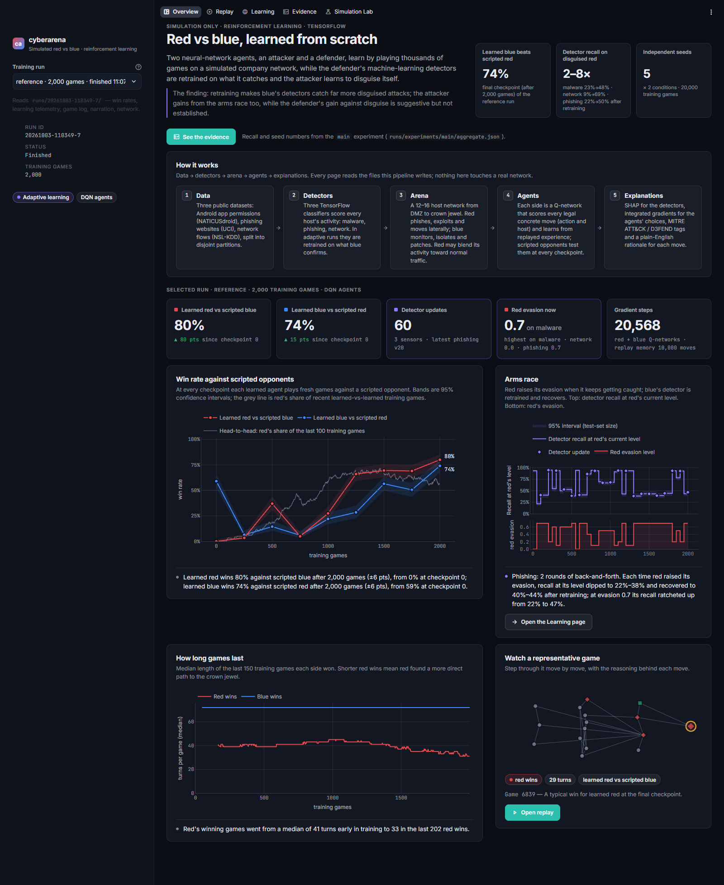
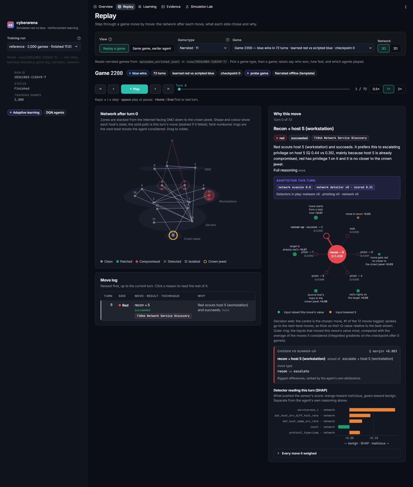
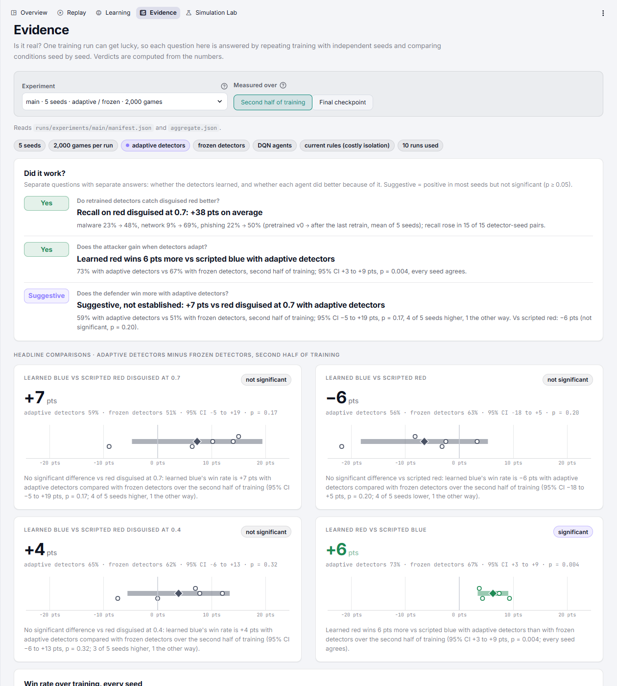
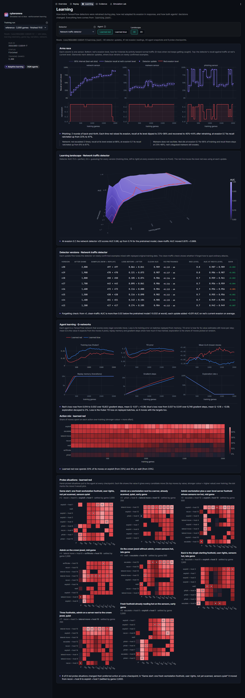
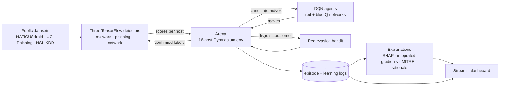

# cyberarena

**A simulated red-team vs blue-team cyber range where both sides learn.** TensorFlow agents learn which hosts to
attack and defend. Blue's TensorFlow malware, phishing and network-anomaly detectors retrain online as red learns to
disguise its activity. Every move is explained (SHAP, integrated gradients, MITRE ATT&CK) and replayable in a
Streamlit dashboard.


> **Simulation only.** Hosts are graph nodes, attacks are abstract actions that flip node state by probability, and
> "evasion" is interpolation between dataset rows in feature space. Nothing here touches a real network or contains
> exploit code. The only network access is the one-time dataset download.

| Overview | Replay: why this move |
|---|---|
|  |  |
| **Evidence: did it work?** | **Learning: the arms race** |
|  |  |

## Results

All numbers come from the logged runs in this repo. "Late" means the mean over checkpoints 1,000–2,000 of a 2,000-game
run, and 5-seed results are paired by seed.

**The arms race is real at the detector level.** Recall on attacks disguised at 0.7 (held-out rows the detector never
trained on), from the first detector update to the last, averaged over 5 seeds:

| Detector | Recall @ evasion 0.7, first update → last |
|---|---|
| Network anomaly (NSL-KDD) | 9% → 69% |
| Phishing (UCI) | 22% → 50% |
| Malware (NATICUSdroid) | 23% → 48% |

**Learned agents beat scripted opponents.** Reference run, seed 7, final checkpoint, 200 games per cell:

| Matchup | DQN (TensorFlow) | Tabular Q-learning |
|---|---|---|
| Learned red vs scripted blue | 80% | 73% |
| Learned blue vs scripted red | 74% | 56% |
| Learned blue vs red disguised @ 0.7 | 79% | 51% |

Scripted red against scripted blue splits 44% / 56%.

**Does adaptation help the agents? 5 seeds, adaptive − frozen detectors:**

| Effect | Late | Final checkpoint | Verdict |
|---|---|---|---|
| Learned red vs scripted blue | **+6.2 pts** (CI +3.4 to +9.1, p = 0.004, 5/5 seeds) | +7.0 pts (p = 0.12) | Significant |
| Learned blue vs red disguised @ 0.7 | +7.3 pts (CI −4.8 to +19.4, p = 0.17, 4/5 seeds) | +21.8 pts (p = 0.077, 5/5 seeds) | Suggestive, not established |
| Learned blue vs undisguised scripted red | −6.5 pts (p = 0.20) | +2.9 pts (p = 0.66) | No detectable effect |

**What we learned along the way.** Under the original rules, isolating a clean host was nearly free (0.1 penalty plus
0.01 per turn). Blue could win by cutting hosts off on a hunch, and the pretrained detectors' false alarms gave it more
chances to do so. Adaptive detectors then made DQN blue *significantly worse* (−19 pts late vs scripted red, p = 0.018).
A 2×2 factorial (detectors frozen/adaptive × red evasion on/off) and fixed-agent cross-evaluation traced this to
detector retraining cutting false alarms in the training pool (−10.5 pts, p = 0.006, every seed). Red's evasion and
non-stationary inputs were ruled out. With realistic isolation costs (0.3 / 0.03, now the default) the penalty
disappears. Both rule sets are kept: `--rules cheap-isolation` reproduces the earlier results, and the experiments are
in `runs/experiments/main-cheap-isolation` and `diag-*`.

## How it works



| Layer | What it does | Code |
|---|---|---|
| **Detectors** | Three Keras MLPs trained on deduplicated public datasets with leakage checks. Online, each is fine-tuned on labels blue *confirms* by acting on a host, mixed with replayed original training data to limit forgetting. | `src/cyberarena/ml/` |
| **Arena** | Turn-based Gymnasium env: DMZ, workstations, servers and a crown jewel. Each host emits real held-out dataset rows; red's actions emit malicious rows blended toward benign at its current evasion level. Scores are pre-computed per evasion level, so steps never call TensorFlow. | `src/cyberarena/arena/env.py` |
| **Agents** | Double-DQN Q-networks (Keras) that score every legal `(action, source, target)` move from 42 (red) / 31 (blue) features. Blue's features are restricted to what a defender could know, and a test enforces it. A tabular Q-learning agent is kept for comparison. | `arena/dqn.py`, `arena/features.py` |
| **Red adaptation** | A bandit per sensor that raises evasion when red keeps getting caught and lowers it when disguise costs too much success. | `arena/adaptation.py` |
| **Experiments** | Multi-seed runner: t-intervals across seeds, paired t-tests between conditions, and an arms-race cycle count. | `arena/experiment.py` |
| **Explanations** | SHAP on the detector version that actually scored each row; exact integrated gradients on the agent's Q-network ("why this host over the runner-up"); MITRE ATT&CK / D3FEND tags; offline template rationales. | `src/cyberarena/explain/` |
| **Dashboard** | Overview, Replay (3D network, decision web, the same game at an earlier checkpoint), Learning (arms race, learning landscape), Evidence (multi-seed statistics) and a Simulation Lab for running new configurations. | `src/cyberarena/dashboard/` |

## Quick start

Requires Python 3.12. TensorFlow has no wheels for 3.13+ yet.

```bash
python3.12 -m venv .venv
# Windows: .venv\Scripts\activate    macOS/Linux: source .venv/bin/activate
pip install -r requirements-lock.txt
pip install -e . --no-deps

python -m cyberarena.pipeline --quick      # ~3 min smoke build (300 games: checks the install, too short for results)
python -m cyberarena.pipeline              # full build: data → detectors → reference run → explanations → 5-seed experiment
streamlit run src/cyberarena/dashboard/app.py
```

The pipeline skips steps whose outputs already exist (`--force` redoes them, `--dry-run` shows the plan). Everything
runs offline and free. Narration uses deterministic templates. A Claude-written narration path exists behind an
explicit `--online` flag, and needs your own API key.

Run the tests with `pytest`, and lint with `ruff check src tests`.

## Hosting a public showcase

Your local install stays the admin copy: train runs, launch experiments, and use the Lab. The public site is a
read-only dashboard over the runs you choose to publish. It has no Lab and launches no processes, and it ships no
training code or model weights. It runs free on [Streamlit Community Cloud](https://share.streamlit.io).

1. **Choose what to publish.** Use the *Publish* toggles in the Lab's run history and on the Evidence page, or pass
   names on the command line:
   `python -m cyberarena.showcase --runs reference,"tabular comparison" --experiments main`
2. **Export and assemble:**
   ```bash
   python -m cyberarena.showcase    # writes showcase/ (~45 MB; local paths scrubbed)
   python -m cyberarena.deploy      # writes build/streamlit-cloud: dashboard code + showcase + slim requirements
   ```
3. **Commit the bundle to the `showcase` branch.** The first time, attach the folder to an orphan branch:
   ```bash
   git worktree add --orphan -b showcase build/streamlit-cloud   # once; then re-run step 2 to fill it
   cd build/streamlit-cloud
   git add -A && git commit -m "Publish showcase" && git push -u origin showcase
   ```
4. **Deploy:** on share.streamlit.io, choose **Create app**, then this repository, branch `showcase`, and main file
   `src/cyberarena/dashboard/app.py`. Under *Advanced settings*, pick **Python 3.12**.

To update, re-run step 2, then `git add -A && git commit -m "Update showcase" && git push` inside
`build/streamlit-cloud`; the app redeploys on its own. `deploy` rebuilds the folder but keeps its git link.

The bundle carries a `PUBLIC_SHOWCASE` marker that switches the app to read-only mode with no host settings. Every
code path that could launch a process refuses in that mode, and tests enforce it. `--target hf-docker` builds a Hugging
Face Docker Space instead (Hugging Face currently requires a paid plan for Docker Spaces).

## Methods

- **Information boundary.** Blue's features use only what a defender could know: detected/isolated/patched/confirmed
  state, detector scores, topology and the clock. A test mutates every hidden field (true compromise, privilege, red's
  evasion, trails) and asserts blue's inputs don't change.
- **Detector learning.** Labels are revealed only when blue acts on a host (isolate, restore, reset credentials, or a
  confirmed phishing campaign). Each update mixes those rows 1:1 with replayed original training data; turning replay off
  roughly doubles the false-positive rate on malware.
- **Disjoint data.** Each detector's held-out rows are split by unique feature vector into three partitions: `metric`
  (reported AUC and recall), `arena_train` (training-game pools, the only source of update labels) and `arena_eval`
  (evaluation-game pools). Evaluation games never use rows a detector learned from.
- **Evaluation.** At every checkpoint, each learned agent plays fresh greedy games against a scripted opponent: 200
  games per matchup, plus 100 per disguise level against an evading scripted red. Training RNG state is saved and
  restored around evaluation, so evaluation never changes training.
- **Statistics.** Across seeds, t-intervals (sd with ddof = 1). Between conditions, two-sided paired t-tests on the same
  seeds. An arms-race "cycle" is a ≥ 0.2 rise in red's evasion level followed by a ≥ 0.2 fall.
- **Explanations.** SHAP KernelExplainer (2,000 samples, k-means background) against the detector version that
  scored the row. Integrated gradients on the agent's Q-network, computed exactly along the piecewise-linear ReLU path
  (completeness error 0), against the mean of that turn's candidate moves, so the attribution answers "why this move
  rather than a typical alternative".

## Limitations

- **Five seeds** are enough to detect the red effect and the earlier blue penalty, not the smaller blue benefit under the
  current rules. More seeds would settle it. The experiment runner takes `--seeds 1-20`.
- **A stylised game.** One 16-host topology per seed, abstract actions with fixed success probabilities, and evasion as
  linear blending in feature space. The results are about this game, not real networks.
- **Detectors partly memorise their training pool.** In-game false-alarm rates fall much faster than on held-out rows.
  Evaluation uses disjoint rows, so reported recall is not inflated, but in-game play reflects some memorisation.
- **Reproducibility.** Frozen-detector runs and the DQN are bit-reproducible. Adaptive detector updates can diverge
  under heavy parallel CPU load because of TensorFlow float nondeterminism. Aggregate results are stable, but individual
  runs may not match byte-for-byte.
- **Labels and data.** NATICUSdroid's label column is undocumented; 1 = malware is inferred from permission patterns.
  NSL-KDD's test set contains attack types absent from training, which caps network recall.
- **Narration** is template-based and sometimes long. Strong reasons are reported as found; blue's choices often win
  by small Q margins.

## Project layout

```
src/cyberarena/
  ml/          datasets, detector training, adaptive detectors, inference
  arena/       environment, DQN + tabular agents, red evasion bandit, training, experiments, cross-evaluation
  explain/     SHAP, integrated gradients, MITRE mapping, rationale, enrichment CLI
  dashboard/   Streamlit app (Overview, Replay, Learning, Evidence, Simulation Lab)
  pipeline.py  one-command build
docs/contracts.md   interfaces between the layers (log schemas, CLI flags, file layout)
tests/              unit and integration tests (stubs and small fixtures; no downloads)
```

## License

MIT. See [LICENSE](LICENSE).
